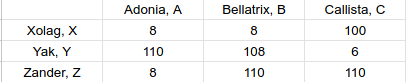
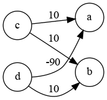
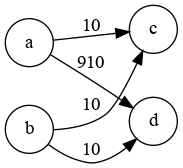

  SAE S2.02 -- Rapport pour la ressource Graphes
  ===

  *Desmee Nathan, Ouhdda Anas, Belguebli Rayane Groupe A1*
  
# **Version 1**
  ---
  
## **Étude d'un premier exemple**
  
  Comme appariement compatible il y a :

  - Adonia, A -- Xolag, X
  - Adonia, A -- Zander, Z
  - Bellatrix, B -- Xolag, X
  - Callista, C -- Yak, Y

  Ce sont les appariements compatibles car les autres appariements c'est soit ils n'ont pas de loisirs en commun et donc ils ne sont pas compatibles car dans l'énnoncé il est dit que les adolescents français ne peuvent qu'aller chez un hôte ayant au moins un loisir en commun. Et la deuxième raison que les autres appariements ne soient pas compatibles est l'allergie aux animaux que possède seulement Bellatrix, B qui n'est donc pas compatible avec Yak, Y qui à un animal même si ils ont un loisir en commun 

  Donc l'appariement optimal est Bellatrix--Xolag, Adonia--Zander, et Callista--Yak car Callista et Bellatrix ne peuvent aller que chez Yak et Xolag respectivement donc il ne reste plus que Zander pour Adonia parce qu'on s'occupe d'abord de ceux ayant le moins de possibilité. 
  
## **Modélisation de l'exemple**

  

  

  \newpage
  Dans l'exemple ci-dessus :

  - les poids des arrêtes qui sont de 8 veulent dire que les adolescents on 1 loisir en commun.
  - le poids de 6 veut dire que les adolescents ont 2 loisirs en commun.
  - les poids qui ont une valeur de 110 veulent dire qu'il y a une imcompatibilité entre les adolescents
  - et le poids de 108 veut dire qu'il y a une incompatibilité malgrès qu'ils aient un loisir en commun.

## **Modélisation pour la Version 1**
  
  Donc nous avons décidé de mettre un poids de base entre chaque adolescent de 10. On augmente de 100 si il y a imcompatibilité dû à la raison que les adolescents français ne peuvent qu'aller chez un hôte ayant au moins un loisir en commun et à l'allergie aux animaux. On enlève 2 pour chaques loisirs en commun.
  
## **Implémentation de la Version 1**
  
  (voir '[AffectationUtil.java](../src/languageStay/graph/AffectationUtil.java)')

  (voir '[TestAffectationVersion1.java](../test/languageStay/graph/TestAffectationVersion1.java)')
  
## **Exemple de vérification de l'incompatibilité** 

  La particularité de cette exemple est que des adolescents n'ont pas mis de loisir, que d'autres en ont mis beaucoup et que l'adolescent A A est allergique aux animaux et il possède un animal.

  Dans notre méthode weight dans la classe *AffectationUtil.java* nous avons passé de 100 à 1000 l'incompatibilité entre adolescents car si ils sont imcopatibles mais qu'ils ont beaucoup d'hobbies en commun le poids peut très vite descendre comme on enlève 2 pour chaque loisir en commun.
  
  (voir '[TestAffectationVersion1.java méthode *testCompatibilityVsHobbies()*](../test/languageStay/graph/TestAffectationVersion1.java)')

  Voici les graphes en rapport avec les affectations : 

  

  

\newpage
# Version 2
  ---
  
  Sera évaluée à partir du tag git `Graphes-v2`
  
## Exemple minimal pour la gestion de l'historique
  
  *Présenter un exemple minimal qui est pertinent pour tester l'historique. L'exemple contiendra:*
  - *huit adolescents de deux pays différents tels que* 
    - *certains des adolescents expriment des préférences d'historique (critère HISTORY). Toutes les valeurs possibles pour ce critère doivent être présentes* 
    - *aucun des adolescents n'est allergique aux animaux en aucun n'a exprimé de passe-temps, ainsi pour l'instant on peut se concentrer uniquement sur la gestion de l'historique*
  - *un historique, c'est à dire une collection de paires d'adolescents qui étaient correspondants l'année passée. Ces paires doivent permettre d'illustrer les différents cas de figure qui peuvent se présenter par rapport aux contraintes d'historique et les huit adolescents*
  
  *Puis, donner un appariement optimal qui tient compte des données d'historique, et expliquer pourquoi il est optimal. L'explication ne doit pas parler des graphes, mais uniquement des adolescents et les critères exprimés.*
  
## Deuxième exemple pour la gestion d'historique
  
  *Modifiez l'exemple précédent en ajoutant des préférences liées aux passe-temps. Donnez l'appariement que vous considérez optimal dans ce cas. En particulier, expliquez comment vous comptez combiner une éventuelle affinité liée à l'historique avec l'affinité liée aux passe-temps. Rappelons que l'historique peut compter comme une contrainte rédhibitoire ou comme une préférence, voir le sujet pour plus de précisions.*
  
  *Donner l'appariement que vous considérez optimal dans ce deuxième exemple, toujours sans parler de graphes.*
  
## Modélisation pour les exemples
  
  *Pour chacun des deux exemples précédents, donnez un graphe (donné par sa matrice d'adjacence) tel que l'affectation minimale dans ce graphe correspond à l'appariement optimal identifié plus haut. Expliquez comment vous avez choisi le poids pour chacune des arêtes.*
  
## Modélisation pour l'historique de la Version 2
  
  *Décrire une modélisation générale pour la Version 1. C'est à dire, donner une formule ou une description précise qui décrit comment, étant donné un adolescent hôte et un adolescent visiteur, on détermine le poids de l'arête entre ces deux adolescents en fonction des critères considérés dans la Version 1. Décrire également comment vous construisez le graphe modèle à partir des données en entrée.*
  
## Implémentation de l'historique de la Version 2
  
  *Quelles fonctions de votre code avez-vous modifié pour prendre en compte le critère historique ? Donnez ici les noms des méthodes (et leur classe), à quoi elles servent, et quelles modifications vous avez apportées. Essayez d'être synthétique.*
  
## Test pour l'historique de la Version 2
  
  *Créer la classe de TestAffectationVersion2 qui contiendra deux méthodes de test, une pour chacun des exemples. Chacune de ces méthodes doit avoir la même structure que pour TestAffectationVersion1, c'est à dire créer les données d'entrée (adolescents, historique), créer le graphe, calculer l'affectation, et tester que le résultat est comme attendu.*
  
## Prendre en compte les autres préférences
  
  *Pour chacun des autres critères d'affinité que vous décidez de prendre en compte, décrire comment vous changez la fonction weight de la classe AffectationUtil.*
  
## L'incompatibilité en tant que malus
  
  *Proposer une formule ou une description précise qui explique comment calculer le poids d'une arête en considérant les incompatibilités comme des malus et les critères satisfaits comme des bonus. Implémenter cette formule dans une seconde méthode appelée `weightAdvanced`, ceci pour éviter de casser votre code. Puis, écrire une méthode de test qui permet d'illustrer le calcul d'affectation basé sur `weightAdvanced`. Vous pouvez égalmente tester l'affectation en utilisant le fichier de données `incompatibilityVsBonus.csv`.*